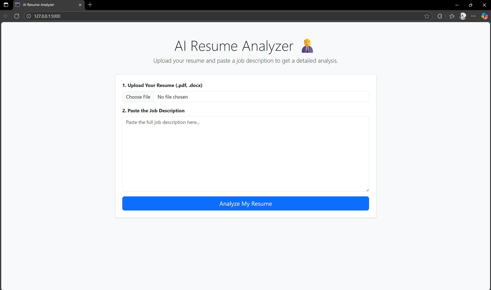

# AI Resume Analyzer 🧑‍💼

A powerful tool built with Python, Flask, and the Google Gemini API to help job seekers tailor their resumes for specific job descriptions.


<<<<<<< HEAD
=======


## 🚀 Features

- **File Upload**: Supports resume uploads in both PDF (.pdf) and Word (.docx) formats.
- **AI-Powered Analysis**: Uses the Google Gemini API to conduct an in-depth comparison between a resume and a job description.
- **Structured Reporting**: Generates a clean, easy-to-read report with key sections like a match score, strengths, skill gaps, and improvement suggestions.
- **Actionable Feedback**: Provides custom project ideas to help users build experience for their target roles.
- **User-friendly Web Interface**: Intuitive and easy-to-use UI built with Flask.

## 🛠️ Tech Stack

- **Backend Framework**: Flask
- **AI Model**: Google Gemini API
- **File Handling**: PyMuPDF (for PDF), python-docx (for Word)
- **Frontend**: HTML, CSS (consider using Bootstrap or Tailwind CSS for enhanced UI)
- **Language**: Python

## 📁 Project Structure

```
ai-resume-analyzer/
├── app.py                     # Main Flask application file
├── .env                       # For storing the API Key
├── templates/                 # HTML templates
│   ├── index.html             # Main upload and input form
│   └── report.html            # Displays analysis report
├── static/                    # Static files (CSS, JS, images)
│   ├── css/
│   │   └── style.css
│   └── images/
│       └── prototype.png
└── requirements.txt           # Project dependencies
```

## ⚙️ How to Run Locally

### ✅ Prerequisites

- Python 3.7+
- pip

### 📦 Setup Instructions

**Clone the Repository**

```bash
git clone https://github.com/yourusername/ai-resume-analyzer.git
cd ai-resume-analyzer
```

(Remember to replace `yourusername` with your actual GitHub username)

**Create and Activate a Virtual Environment**

For Mac/Linux:

```bash
python3 -m venv venv
source venv/bin/activate
```

For Windows:

```bash
python -m venv venv
.env\Scriptsctivate
```

**Install Required Packages**

```bash
pip install -r requirements.txt
```

(Make sure `requirements.txt` contains Flask, google-generativeai, python-dotenv, PyMuPDF, python-docx)

**Configure Environment Variables**

Create a file named `.env` in the root project folder and add your Google Gemini API key:

```env
GEMINI_API_KEY="YOUR_API_KEY_HERE"
```

(Replace `"YOUR_API_KEY_HERE"` with your actual API key)

### 🏃 Run the App

```bash
flask run
```

Visit the URL provided in your terminal (usually http://127.0.0.1:5000) in your browser.

## 🧠 Future Improvements

- [ ] Export the analysis report to PDF format.
- [ ] Track analysis history for different job applications.
- [ ] Add a feature to analyze a LinkedIn profile URL instead of a resume file.
<<<<<<< HEAD
- [ ] Visualize skill matches and gaps with charts and graphs.
=======
- [ ] Visualize skill matches and gaps with charts and graphs.
